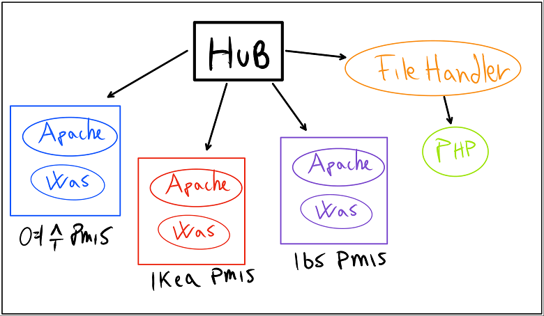

# Hub for PMIS instances

Thss web server is used as a controller for several PMIS application running on the same server.

## Configuration

Under the folder `hub/conf.d` there are two examples of configuration for one PMIS application.

**backed1.conf.sample** - This is used for *SSL/TLS* connection with redirection from port *80* to *443*.

**backed2.conf.sample** - This is the simple *HTTP* connection.

Make a copy of one of these example, you can rename it with the name of the application.
Inside you need to change the *dns* (the name after the directive `server_name`) 
and the upstream server name (the name after the directive set `$upstream_webapp`).

The upstream name is the value you gave to the variable [`HUB_INSTANCE`](https://github.com/sangahco/docker-pmis-app/blob/master/README.md "PMIS deploy guide")

---

## Run using `docker-auto` script

This is the recommended way to run this service, start the service with the following command:

    $ ./docker-auto --prod up

or if you are editing and testing the service with:

    $ ./docker-auto --dev up

See the help for more commands:

    $ ./docker-auto --help

Check the services are running with:

    $ ./docker-auto --prod ps

## Run with `docker-compose`

Before running the service create the network and the temporary volume with the following command:

    $ docker network create hub_net
    $ docker volume create --name=tmp

Then start the service with:

    $ docker-compose up --build -d

Or to check new images and update and build with:

    $ docker-compose pull
    $ docker-compose build --pull
    $ docker-compose up -d

## Test and Reload the Hub

Everytime we make some change to the configuration under the folder `conf.d` we need to reload the hub.
In case the hub is running and we don't want to cause a crash of the service in case we made some mistakes is always better to check if the configuration we changed has some errors.

In order to try the configuration we can use the following command from the hub folder (make sure the hub is running).

    $ ./docker-auto.sh exec hub nginx -t

You will se some a bunch of log telling you if the configuration is fine or has errors.
If there is no errors you can safely reload the service.

Reload the service with the following command:

    $ ./docker-auto.sh reload
